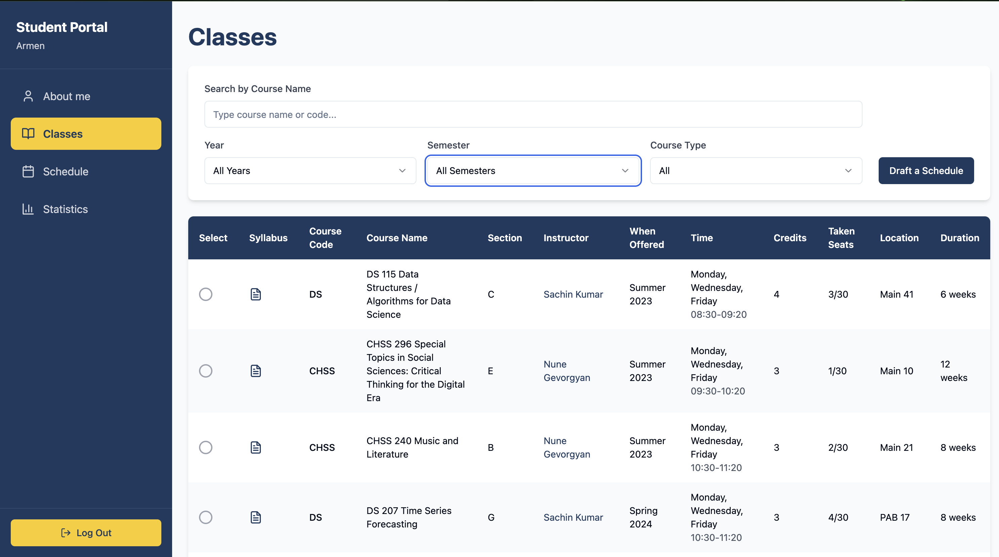
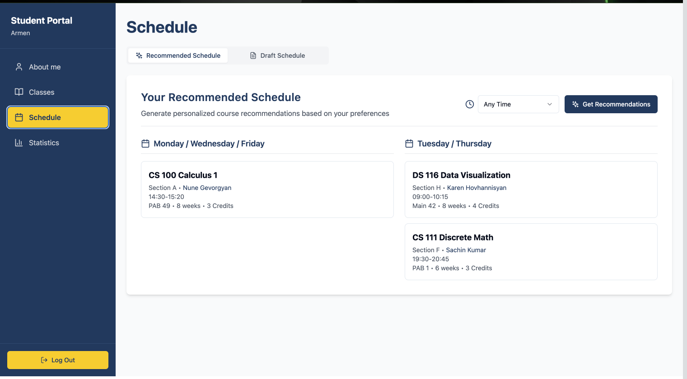
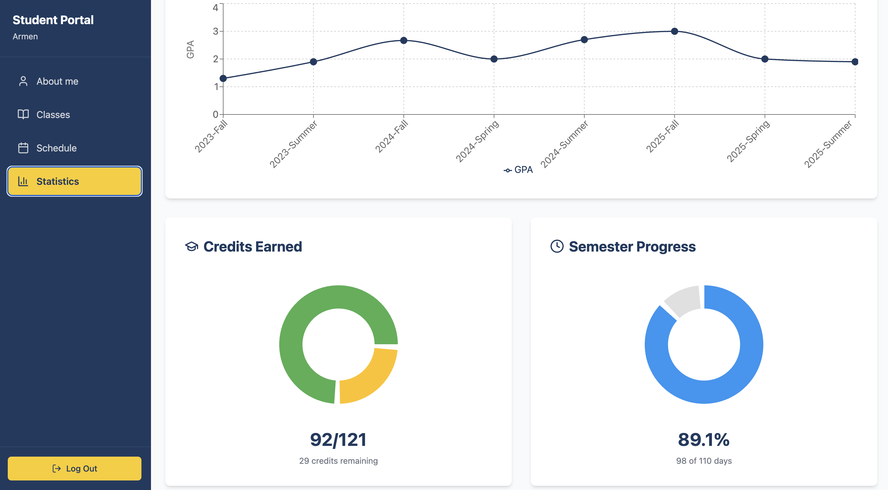
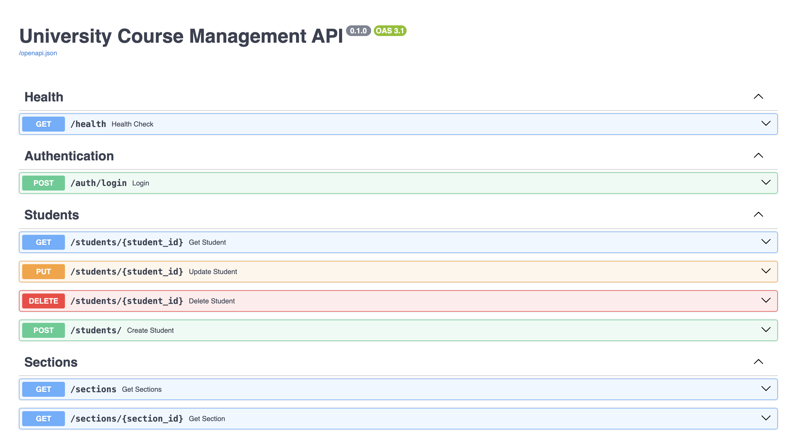

# University Course Management System

Full-stack application for managing university courses, students, and schedules.

## Architecture

- **Frontend**: React + TypeScript (Vite)
- **Backend**: FastAPI (Python)
- **Database**: PostgreSQL
- **ETL**: Python scripts for data generation and loading
- **Documentation**: MkDocs

## Quick Start

1. **Clone and navigate:**
   ```bash
   git clone https://github.com/DS-223-2025-Fall/group-3
   cd group-3/university_app/
   ```

2. **Start services:**
   ```bash
   docker compose up -d --build
   ```

3. **Access:**
   - Frontend: http://localhost:5173
   - API: http://localhost:8008
   - API Docs: http://localhost:8008/docs
   - pgAdmin: http://localhost:5050
   - Documentation: http://127.0.0.1:8000
     ```bash
     # Install documentation dependencies (optional, for local development)
     cd mkdocs && pip install -r requirements.txt
     
     # Serve documentation locally
     cd mkdocs && python3 -m mkdocs serve
     
     # Build static documentation site
     cd mkdocs && python3 -m mkdocs build
     ```

## Screenshots

### Frontend UI

#### About Me Page


#### Classes/Courses Page


#### Schedule Page


#### Statistics Page


### API Documentation (Swagger)

**Interactive API Documentation:** [http://localhost:8008/docs](http://localhost:8008/docs)

*Access the full interactive Swagger UI documentation to explore all API endpoints, test requests, and view detailed schemas.*

#### Swagger UI - Endpoint Groups


*The main Swagger UI page showing all API endpoints organized by tags (Authentication, Students, Courses, Recommendations, etc.). This provides an overview of all available endpoints grouped by functionality.*

#### Expanded Endpoint Example


*An example of an expanded endpoint showing the detailed request/response schemas, parameters, and data models. This demonstrates the comprehensive API documentation available for each endpoint.*

#### Try It Out Feature


*The interactive "Try it out" feature allows developers to test API endpoints directly from the Swagger UI.*

